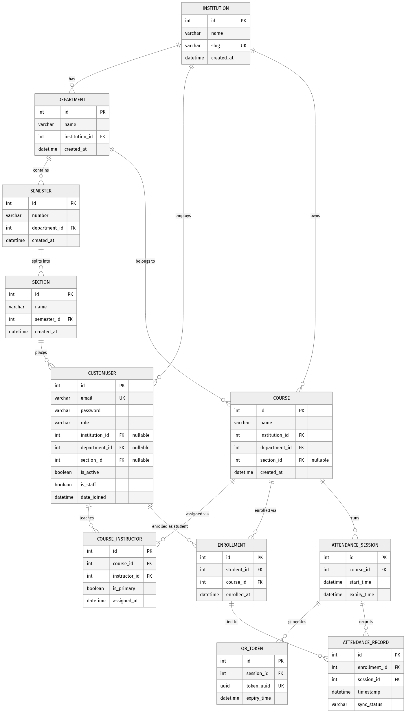

<h1 align="center">
  <br/>
  🎓 SaaS Attendance Management System
  <br/>
</h1>

<p align="center">
  A full-stack, QR-code-based smart attendance platform built for universities and institutions.
  <br/>
  Real-time sessions · Anti-cheat QR rotation · Role-based dashboards · Detailed analytics
</p>

<p align="center">
  
  
  
  
  
  
</p>

---

## 📋 Table of Contents

- [Overview](#-overview)
- [Features](#-features)
- [Tech Stack](#-tech-stack)
- [Architecture](#-architecture)
- [Project Structure](#-project-structure)
- [Getting Started](#-getting-started)
  - [Prerequisites](#prerequisites)
  - [Environment Setup](#environment-setup)
  - [Running with Docker](#running-with-docker-recommended)
  - [Running Locally (Manual)](#running-locally-manual)
- [Default Credentials](#-default-credentials)
- [API Reference](#-api-reference)
- [Role-Based Access](#-role-based-access)
- [Database Schema](#-database-schema)
- [Contributing](#-contributing)

---

## 🌟 Overview

This is a **multi-tenant SaaS Attendance Management System** designed for universities and institutions. It allows teachers to host live, QR-code-based attendance sessions, students to scan and mark themselves present, and admins to manage the entire institution hierarchy — all through a single, beautifully designed web application.

---

## ✨ Features

### 👨‍🏫 Teacher Dashboard
| Feature | Description |
|---------|-------------|
| 🟢 **Live QR Sessions** | Start attendance sessions with a dynamic, zoomable QR code displayed to students |
| 🔄 **Anti-Cheat QR Rotation** | QR token auto-rotates every **10 seconds** — screenshots can't be shared |
| ⏱️ **Custom Session Duration** | Type any duration in minutes or use quick presets (15m, 30m, 1h, 2h…) |
| 📊 **Live Scan Counter** | Real-time count of scans and attendance percentage during the session |
| ✅ **Manual Override** | Mark any student present or absent manually from the live dashboard |
| ⚠️ **Risk Alerts** | Automatic alerts for students below 75% attendance threshold |
| 📜 **Session History** | View all past sessions and re-open or delete them |
| 📧 **Warning Email Trigger** | One-click warning notice dispatch for at-risk students |
| 🔍 **QR Zoom / Fullscreen** | Click the QR code to expand it for projection display |

### 👨‍🎓 Student Portal
| Feature | Description |
|---------|-------------|
| 📷 **QR Scanner** | Camera-based QR scan using the browser — no app download required |
| ✔️ **Instant Confirmation** | Live feedback on successful attendance marking |
| 🔒 **Token Validation** | Server-side validation with rotating tokens prevents replay attacks |

### 🛡️ Admin Panel
| Feature | Description |
|---------|-------------|
| 🏫 **Institution Management** | Create and manage universities, departments, and programmes |
| 👥 **User Management** | Create/edit teacher and student accounts scoped to institutions |
| 📚 **Course Management** | Assign courses to instructors and enroll students |
| 📅 **Session Monitoring** | View all active and past attendance sessions across the platform |

### 📈 Reports & Analytics
| Feature | Description |
|---------|-------------|
| 📊 **Per-Course Reports** | Full attendance breakdown per student per session |
| 🚨 **Defaulters List** | Automated list of students below 75% threshold |
| 📥 **CSV Export** | One-click download of attendance data as a spreadsheet |
| 🔄 **Session-Level Override** | Retroactively correct attendance for any session |

---

## 🛠 Tech Stack

### Backend
| Technology | Version | Purpose |
|-----------|---------|---------|
| **Django** | 4.2 | Web framework & ORM |
| **Django REST Framework** | 3.15 | REST API layer |
| **SimpleJWT** | 5.3 | JWT authentication (8h access / 30d refresh) |
| **django-cors-headers** | 4.3 | Cross-origin request handling |
| **qrcode[pil]** | 7.4 | QR code generation |
| **drf-spectacular** | 0.28 | Auto-generated OpenAPI / Swagger docs |
| **MySQL / SQLite** | — | Database (MySQL in production, SQLite in dev) |
| **Gunicorn** | 21.2 | WSGI server for production |
| **WhiteNoise** | 6.7 | Static file serving |

### Frontend
| Technology | Version | Purpose |
|-----------|---------|---------|
| **React** | 19 | UI framework |
| **Vite** | 8 | Build tool & dev server |
| **Axios** | 1.18 | HTTP client with JWT interceptors |
| **jsQR** | 1.4 | Client-side QR code scanning |
| **Lucide React** | 1.21 | Icon library |
| **Vanilla CSS** | — | Custom design system with GPU-accelerated animations |

---

## 🏗 Architecture

```
┌─────────────────────────────────────────────────────────┐
│                     React Frontend                       │
│  ┌─────────────┐  ┌──────────────┐  ┌───────────────┐  │
│  │  Teacher DB  │  │  Student QR  │  │  Admin Panel  │  │
│  │  Dashboard   │  │   Scanner    │  │               │  │
│  └──────┬──────┘  └──────┬───────┘  └───────┬───────┘  │
│         └────────────────┴──────────────────┘           │
│                     Axios + JWT Auth                     │
└───────────────────────────┬─────────────────────────────┘
                            │ HTTPS / REST API
┌───────────────────────────▼─────────────────────────────┐
│                   Django REST API                        │
│  ┌──────────┐ ┌─────────────┐ ┌──────────┐ ┌────────┐  │
│  │ /auth/*  │ │ /sessions/* │ │/attend/* │ │/report │  │
│  │          │ │ (QR rotate) │ │ (scan)   │ │ /*     │  │
│  └──────────┘ └─────────────┘ └──────────┘ └────────┘  │
│                     Permission Layer                     │
│            IsTeacher | IsStudent | IsAdmin               │
└───────────────────────────┬─────────────────────────────┘
                            │
┌───────────────────────────▼─────────────────────────────┐
│                MySQL / SQLite Database                   │
│  Users · Institutions · Courses · Sessions · Records    │
└─────────────────────────────────────────────────────────┘
```

---

## 📁 Project Structure

```
SaaS-Attendance-App/
├── backend/
│   ├── apps/
│   │   ├── accounts/          # User auth, JWT, role management
│   │   ├── attendance/        # Sessions, QR generation, marking
│   │   ├── courses/           # Courses & enrollments
│   │   ├── institutions/      # Universities & departments
│   │   └── reports/           # Analytics & defaulters
│   ├── attendance_saas/
│   │   ├── settings/
│   │   │   ├── base.py        # Shared settings (JWT, CORS, apps)
│   │   │   ├── dev.py         # SQLite dev config
│   │   │   └── prod.py        # MySQL + WhiteNoise production config
│   │   └── urls.py            # Root URL routing
│   ├── manage.py
│   └── requirements.txt
├── frontend/
│   ├── src/
│   │   ├── components/
│   │   │   └── admin/         # Admin panel tab components
│   │   ├── pages/
│   │   │   ├── Dashboard.jsx  # Teacher dashboard
│   │   │   ├── Reports.jsx    # Analytics & reports
│   │   │   ├── Scanner.jsx    # Student QR scanner
│   │   │   ├── Login.jsx      # Auth page
│   │   │   └── AdminDashboard.jsx
│   │   ├── services/
│   │   │   └── api.js         # Axios instance + queued JWT refresh
│   │   ├── index.css          # Full design system (glass, tokens, animations)
│   │   └── App.jsx            # Root router and auth state
│   ├── index.html
│   └── package.json
├── docker-compose.yml
├── .env.example
└── erd.png                    # Entity-relationship diagram
```

---

## 🚀 Getting Started

### Prerequisites

- **Python** 3.10+
- **Node.js** 18+
- **MySQL** 8.0+ (or use SQLite for development)
- **Docker & Docker Compose** (optional, for containerised setup)

---

### Environment Setup

Copy the example environment file and fill in your values:

```bash
cp .env.example backend/.env
```

```env
# backend/.env
SECRET_KEY=your-very-secret-django-key
ALLOWED_HOSTS=localhost,127.0.0.1
CORS_ALLOWED_ORIGINS=http://localhost:5173,http://localhost:3000

# MySQL (production)
DB_NAME=attendance_db
DB_USER=root
DB_PASSWORD=yourpassword
DB_HOST=localhost
DB_PORT=3306
```

---

### Running with Docker (Recommended)

```bash
# Clone the repository
git clone https://github.com/ahmadmushtaq1333/SaaS-Attendance-App-.git
cd SaaS-Attendance-App-

# Start all services (Django + MySQL + React)
docker-compose up --build
```

- **Frontend:** http://localhost:5173
- **Backend API:** http://localhost:8000/api
- **Swagger Docs:** http://localhost:8000/api/schema/swagger-ui/

---

### Running Locally (Manual)

#### 1. Backend

```bash
cd backend

# Create and activate a virtual environment
python -m venv venv
venv\Scripts\activate        # Windows
# source venv/bin/activate   # macOS/Linux

# Install dependencies
pip install -r requirements.txt

# Run migrations (uses SQLite by default in dev)
python manage.py migrate

# Seed initial data (optional)
python manage.py shell < seed_data.py

# Start the development server
python manage.py runserver
```

#### 2. Frontend

```bash
cd frontend

# Install dependencies
npm install

# Start the dev server
npm run dev
```

The app will be available at **http://localhost:5173**

---

## 🔑 Default Credentials

These credentials are seeded in the development database:

| Role | Email | Password |
|------|-------|----------|
| 👑 Admin | `admin@mit.edu` | `password123` |
| 👨‍🏫 Teacher | `teacher@mit.edu` | `password123` |
| 👨‍🎓 Student | `student@mit.edu` | `password123` |

> ⚠️ **Change these immediately in any production deployment.**

---

## 📡 API Reference

The full interactive API documentation is available via Swagger UI at:

```
http://localhost:8000/api/schema/swagger-ui/
```

### Key Endpoints

| Method | Endpoint | Description | Auth |
|--------|----------|-------------|------|
| `POST` | `/api/auth/login/` | Obtain JWT tokens | Public |
| `POST` | `/api/auth/refresh/` | Refresh access token | Public |
| `GET` | `/api/auth/me/` | Get current user profile | ✅ |
| `GET` | `/api/auth/courses/` | List teacher's assigned courses | Teacher |
| `POST` | `/api/sessions/` | Create a new attendance session | Teacher |
| `GET` | `/api/sessions/` | List all sessions | Teacher |
| `DELETE` | `/api/sessions/{id}/` | Delete a session | Teacher |
| `POST` | `/api/attendance/scan/` | Mark attendance via QR scan | Student |
| `POST` | `/api/attendance/override/` | Manually toggle student attendance | Teacher |
| `GET` | `/api/reports/course/{id}/` | Full course attendance report | Teacher/Admin |
| `GET` | `/api/admin/institutions/` | List all institutions | Admin |
| `GET` | `/api/admin/users/` | List all users | Admin |
| `GET` | `/api/admin/courses/` | List all courses | Admin |

---

## 👥 Role-Based Access

```
Admin
  └── Can manage institutions, departments, users, courses, sessions (all)

Teacher
  └── Can create/manage sessions for their assigned courses
  └── Can view & export reports for their own courses
  └── Can manually override individual student attendance

Student
  └── Can scan QR codes to mark attendance for enrolled courses
  └── Can view own attendance history
```

---

## 🗄 Database Schema

The Entity-Relationship Diagram is available in the repository:



**Core Models:**

| Model | Description |
|-------|-------------|
| `CustomUser` | Extends AbstractBaseUser with `role` field (admin/teacher/student) |
| `Institution` | University or organisation |
| `Department` | Department within an institution |
| `Programme` | Degree programme within a department |
| `Course` | Academic course with instructor assignments |
| `Enrollment` | Student ↔ Course many-to-many relationship |
| `AttendanceSession` | A live QR session with token rotation and expiry |
| `AttendanceRecord` | One record per student per session (present/absent) |

---

## 🔐 Security

- **JWT with 8-hour access tokens** — no mid-class expiry
- **30-day refresh tokens** — persistent logins without re-authentication
- **10-second QR token rotation** — prevents screenshot sharing
- **Role-based permission classes** — `IsTeacher`, `IsStudent`, `IsAdminUser`
- **CORS whitelist** — only configured origins can call the API
- **Queued token refresh** — race-condition-safe simultaneous request handling

---

## 📄 Contributing

1. Fork the repository
2. Create your feature branch: `git checkout -b feature/AmazingFeature`
3. Commit your changes: `git commit -m 'feat: Add AmazingFeature'`
4. Push to the branch: `git push origin feature/AmazingFeature`
5. Open a Pull Request

---

## 📝 License

This project was developed as an academic mini project for the **Introduction to Database Systems** course.

---

<p align="center">
  Built with ❤️ using Django & React
</p>
