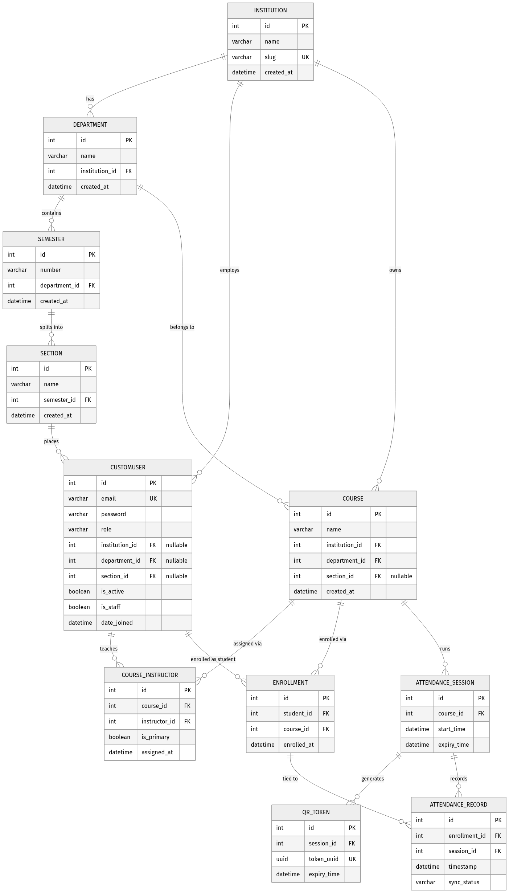

<h1 align="center">
  <br/>
  🎓 Attend AI — SaaS Attendance Management System
  <br/>
</h1>

<p align="center">
  A full-stack, QR-code-based smart attendance platform built for universities and institutions.
  <br/>
  Real-time sessions · Anti-cheat QR rotation · Role-based dashboards · Detailed analytics · Offline PWA
</p>

<p align="center">
  
  
  
  
  
  
  
</p>

---

## 📋 Table of Contents

- [Overview](#-overview)
- [Features](#-features)
- [Tech Stack](#-tech-stack)
- [Architecture](#-architecture)
- [Project Structure](#-project-structure)
- [Institution Hierarchy](#-institution-hierarchy)
- [Database Schema](#-database-schema)
- [Getting Started](#-getting-started)
  - [Prerequisites](#prerequisites)
  - [Environment Setup](#environment-setup)
  - [Running with Docker](#running-with-docker-recommended)
  - [Running Locally (Manual)](#running-locally-manual)
- [API Reference](#-api-reference)
- [Role-Based Access](#-role-based-access)
- [Security](#-security)
- [Deployment](#-deployment)

---

## 🌟 Overview

**Attend AI** is a production-grade, multi-tenant SaaS Attendance Management System designed for universities and institutions. It allows teachers to host live, QR-code-based attendance sessions, students to scan and mark themselves present (even offline with automatic sync), and admins to manage the full institution hierarchy — all through a single, beautifully designed web application deployed on Railway (backend) and Vercel (frontend).

---

## ✨ Features

### 👨‍🏫 Teacher Dashboard
| Feature | Description |
|---------|-------------|
| 🟢 **Live QR Sessions** | Start attendance sessions with a dynamic, zoomable QR code displayed to students |
| 🔄 **Anti-Cheat QR Rotation** | QR token auto-rotates every **10 seconds** — screenshots cannot be shared |
| ⏱️ **Custom Session Duration** | Type any duration in minutes or use quick presets (15m, 30m, 1h, 2h…) |
| 📊 **Live Scan Counter** | Real-time count of scans and attendance percentage during the session |
| ✅ **Manual Override** | Mark any student present or absent manually from the live dashboard |
| ⚠️ **Risk Alerts** | Automatic alerts for students below 75% attendance threshold |
| 📜 **Session History** | View all past sessions and re-open or delete them |
| 📧 **Warning Email Trigger** | One-click warning notice dispatch for at-risk students |
| 🔍 **QR Zoom / Fullscreen** | Click the QR code to expand it for projection display |

### 👨‍🎓 Student Portal
| Feature | Description |
|---------|-------------|
| 📷 **QR Scanner** | Camera-based QR scan using the browser — no app download required |
| ✔️ **Instant Confirmation** | Live feedback on successful attendance marking |
| 🔒 **Token Validation** | Server-side validation with rotating tokens prevents replay attacks |
| 📴 **Offline Mode** | Attendance scans are queued locally when offline and synced automatically on reconnect |
| 📱 **PWA Install** | The app is installable as a Progressive Web App for a native app experience |

### 🛡️ Admin Panel
| Feature | Description |
|---------|-------------|
| 🏫 **Institution Hierarchy** | Full tree management: Institution → Department → Semester → Section |
| 👥 **User Management** | Create, edit, and delete teacher/student accounts with hierarchical filtering |
| 🔽 **Hierarchical Filtering** | Filter users by Institution → Department → Semester → Section via cascading dropdowns |
| 📂 **Excel Bulk Import** | Upload an `.xlsx` spreadsheet to bulk-create students and assign them to a section |
| 🎲 **Bulk Account Generation** | Generate N student accounts with auto-incremented emails and random passwords |
| 📚 **Course Management** | Assign courses to sections and instructors; enroll students |
| 📅 **Session Monitoring** | View all active and past attendance sessions across the platform |
| 🔑 **Email Verification Control** | Manually trigger or bypass verification for bulk-created accounts |

### 📈 Reports & Analytics
| Feature | Description |
|---------|-------------|
| 📊 **Per-Course Reports** | Full attendance breakdown per student per session |
| 🚨 **Defaulters List** | Automated list of students below 75% threshold |
| 📥 **CSV Export** | One-click download of attendance data as a spreadsheet |
| 🔄 **Session-Level Override** | Retroactively correct attendance for any session |

### 🔐 Authentication & Security
| Feature | Description |
|---------|-------------|
| 🍪 **HTTPOnly Cookie Auth** | JWT tokens stored in `HttpOnly` cookies — immune to XSS attacks |
| 🔁 **Silent Token Refresh** | Access token refreshes silently in the background; users never get logged out mid-session |
| 📧 **Email Verification (OTP)** | 6-digit OTP sent via email on signup; must be verified before first login |
| 🔑 **Password Reset via OTP** | Secure, code-based password reset flow without magic links |
| 🚦 **IP-Based Rate Limiting** | Login, OTP, and reset endpoints are protected against brute-force attacks |
| 🛡️ **Role-Based Permissions** | `IsTeacher`, `IsStudent`, `IsAdminUser` permission classes enforce access at the API layer |

---

## 🛠 Tech Stack

### Backend
| Technology | Version | Purpose |
|-----------|---------|---------|
| **Django** | 6.0 | Web framework & ORM |
| **Django REST Framework** | 3.15 | REST API layer |
| **SimpleJWT** | 5.3 | JWT authentication (15m access / 30d refresh, via HTTPOnly cookies) |
| **django-cors-headers** | 4.3 | Cross-origin request handling |
| **django-ratelimit** | 4.1 | IP-based rate limiting on auth endpoints |
| **django-anymail** | 10+ | Transactional email via Brevo API (production) |
| **openpyxl** | 3.1 | Excel `.xlsx` parsing for bulk user import |
| **qrcode[pil]** | 7.4 | QR code generation |
| **drf-spectacular** | 0.28 | Auto-generated OpenAPI / Swagger docs |
| **sentry-sdk** | latest | Error tracking in production |
| **MySQL / SQLite** | — | Database (MySQL in production, SQLite in dev) |
| **Gunicorn** | 21.2 | WSGI server for production |
| **WhiteNoise** | 6.7 | Static file serving |

### Frontend
| Technology | Version | Purpose |
|-----------|---------|---------|
| **React** | 19 | UI framework |
| **Vite** | 8 | Build tool & dev server |
| **Axios** | 1.18 | HTTP client with queued JWT refresh interceptor |
| **jsQR** | 1.4 | Client-side QR code scanning |
| **Lucide React** | 1.21 | Icon library |
| **Vanilla CSS** | — | Custom design system with GPU-accelerated animations |
| **PWA / Service Worker** | — | Offline support and installability |

---

## 🏗 Architecture

```
┌─────────────────────────────────────────────────────────┐
│                     React Frontend                       │
│  ┌─────────────┐  ┌──────────────┐  ┌───────────────┐  │
│  │  Teacher     │  │  Student QR  │  │  Admin Panel  │  │
│  │  Dashboard   │  │   Scanner    │  │  (5 tabs)     │  │
│  └──────┬──────┘  └──────┬───────┘  └───────┬───────┘  │
│         └────────────────┴──────────────────┘           │
│         Axios (withCredentials) + HTTPOnly JWT Cookie    │
└───────────────────────────┬─────────────────────────────┘
                            │ HTTPS / REST API
┌───────────────────────────▼─────────────────────────────┐
│                   Django REST API                        │
│  ┌──────────┐ ┌─────────────┐ ┌──────────┐ ┌────────┐  │
│  │ /auth/*  │ │ /sessions/* │ │/attend/* │ │/report │  │
│  │ (cookie) │ │ (QR rotate) │ │ (scan)   │ │ /*     │  │
│  └──────────┘ └─────────────┘ └──────────┘ └────────┘  │
│      ┌───────────────────────────────────┐              │
│      │      /admin/* (AdminViewSets)      │              │
│      │  Users · Import · Courses · Orgs  │              │
│      └───────────────────────────────────┘              │
│                  Permission Layer                        │
│          IsTeacher | IsStudent | IsAdminUser             │
└───────────────────────────┬─────────────────────────────┘
                            │
┌───────────────────────────▼─────────────────────────────┐
│              MySQL (Railway) / SQLite (Dev)              │
│  Users · Institutions · Departments · Semesters ·       │
│  Sections · Courses · Enrollments · Sessions · Records  │
└─────────────────────────────────────────────────────────┘
```

---

## 📁 Project Structure

```
SaaS-Attendance-App/
├── backend/
│   ├── apps/
│   │   ├── accounts/
│   │   │   ├── authentication.py      # CookieJWTAuthentication (reads access_token cookie)
│   │   │   ├── models.py              # CustomUser with role + section FK hierarchy
│   │   │   ├── serializers.py         # UserSerializer + CustomTokenObtainPairSerializer
│   │   │   ├── serializers_admin.py   # Admin-facing serializers with computed_ fields
│   │   │   ├── views.py               # Login (cookie), refresh, OTP verify, password reset
│   │   │   ├── views_admin.py         # AdminUserViewSet: CRUD, bulk generate, Excel import
│   │   │   ├── urls.py                # /auth/* routes
│   │   │   ├── urls_admin.py          # /admin/users/* routes
│   │   │   └── permissions.py         # IsTeacher, IsStudent, IsAdminUser
│   │   ├── attendance/
│   │   │   ├── models.py              # AttendanceSession, QRToken, AttendanceRecord
│   │   │   ├── views_sessions.py      # Session CRUD + QR token rotation
│   │   │   ├── views_marking.py       # QR scan validation + manual override
│   │   │   └── views_override.py      # Retroactive attendance correction
│   │   ├── courses/
│   │   │   ├── models.py              # Course, Enrollment, CourseInstructor
│   │   │   └── views.py              # Course & enrollment management
│   │   ├── institutions/
│   │   │   └── models.py              # Institution, Department, Semester, Section
│   │   └── reports/
│   │       └── views.py               # Per-course reports, defaulters, CSV export
│   ├── attendance_saas/
│   │   ├── settings/
│   │   │   ├── base.py                # Shared settings (JWT, CORS, apps, rate limits)
│   │   │   ├── dev.py                 # SQLite dev config
│   │   │   └── prod.py                # MySQL + WhiteNoise + Brevo email (Railway)
│   │   └── urls.py                    # Root URL routing
│   ├── manage.py
│   └── requirements.txt
├── frontend/
│   ├── public/
│   │   ├── manifest.json              # PWA manifest
│   │   ├── sw.js                      # Service worker for offline caching
│   │   ├── favicon.svg
│   │   └── icons.svg
│   ├── src/
│   │   ├── components/
│   │   │   ├── AccordionSection.jsx   # Reusable collapsible section
│   │   │   └── admin/
│   │   │       ├── UsersPanel.jsx     # User CRUD + hierarchical filter dropdowns
│   │   │       ├── CoursesPanel.jsx   # Course & enrollment management
│   │   │       ├── InstitutionsPanel.jsx # Inst → Dept → Semester → Section tree
│   │   │       ├── SessionsPanel.jsx  # Session monitoring across all institutions
│   │   │       └── ExcelImportPanel.jsx  # .xlsx bulk import with batch assignment
│   │   ├── pages/
│   │   │   ├── Login.jsx              # Auth page (email + password)
│   │   │   ├── EmailVerification.jsx  # OTP verification page for new accounts
│   │   │   ├── ForgotPassword.jsx     # OTP-based password reset flow
│   │   │   ├── AdminDashboard.jsx     # Admin panel shell with 5-tab navigation
│   │   │   ├── Dashboard.jsx          # Teacher dashboard (sessions + live QR)
│   │   │   ├── Reports.jsx            # Analytics & reports page
│   │   │   └── Scanner.jsx            # Student QR scanner with offline queue
│   │   ├── services/
│   │   │   ├── api.js                 # Axios instance + queued silent refresh interceptor
│   │   │   └── offline.js             # IndexedDB queue for offline attendance scans
│   │   ├── utils/
│   │   │   └── date.js                # Date formatting helpers
│   │   ├── App.jsx                    # Root router, auth state, logout listener
│   │   ├── index.css                  # Full design system (glass, tokens, animations)
│   │   └── main.jsx                   # React entry point
│   ├── nginx.conf                     # Nginx config for Docker deployment
│   ├── Dockerfile                     # Frontend Docker image
│   ├── vercel.json                    # Vercel SPA rewrite rules
│   └── package.json
├── docker-compose.yml                 # Multi-service local stack (Django + MySQL + React)
├── erd.mmd                            # Entity-relationship diagram (Mermaid source)
├── erd.png                            # Entity-relationship diagram (rendered)
├── vercel.json                        # Root-level Vercel config
└── .env.example                       # Environment variable template
```

---

## 🏛 Institution Hierarchy

The system uses a **4-level hierarchy** for organizing students:

```
Institution  (e.g. MIT, UET)
  └── Department  (e.g. Computer Science, Software Engineering)
        └── Semester  (e.g. Semester 1, Fall 2026)
              └── Section  (e.g. Section A, Section B)
                    └── Students  (assigned at section level)
```

- **Students** are assigned to a **Section**. Their Department, Semester, and Institution are all **derived automatically** from their section — no redundant data entry.
- **Teachers and Admins** are assigned directly to an Institution and optionally a Department.
- The Admin Panel's **Users tab** provides **cascading dropdown filters** (Institution → Department → Semester → Section) to drill down and view exactly the students you need.
- The **Excel Import** and **Bulk Generate** features allow batch-assigning users directly to a selected Section in one step.

---

## 🗄 Database Schema

The Entity-Relationship Diagram is available in the repository:



**Core Models:**

| Model | Key Fields | Description |
|-------|-----------|-------------|
| `CustomUser` | `role`, `section` (FK), `institution` (FK), `is_email_verified` | Custom user with role-based hierarchy. Students derive institution/department from their section. |
| `EmailVerificationCode` | `code`, `purpose`, `expires_at`, `failed_attempts` | OTP codes for email verification and password reset. Max 5 failed attempts. |
| `Institution` | `name`, `slug`, `domain` | University or organisation. Domain used for email validation during import. |
| `Department` | `name`, `institution` (FK) | Department within an institution. |
| `Semester` | `number`, `department` (FK) | Semester or term within a department. |
| `Section` | `name`, `semester` (FK) | Class section. Students are assigned here. |
| `Course` | `name`, `institution`, `department`, `section` (FK) | Academic course, optionally scoped to a section. |
| `CourseInstructor` | `course`, `instructor`, `is_primary` | Many-to-many between courses and teachers. |
| `Enrollment` | `student`, `course` | Many-to-many student-course enrollment. Unique per student+course. |
| `AttendanceSession` | `course`, `expiry_time` | A live QR session with rotating tokens. |
| `QRToken` | `session`, `token_uuid`, `expiry_time` | Rolling 10-second token. Only the latest is valid. |
| `AttendanceRecord` | `enrollment`, `session`, `timestamp` | One record per enrollment per session. Unique constraint prevents duplicates. |

---

## 🚀 Getting Started

### Prerequisites

- **Python** 3.10+
- **Node.js** 18+
- **MySQL** 8.0+ (or use SQLite for development — no setup required)
- **Docker & Docker Compose** (optional, for containerised setup)

---

### Environment Setup

Copy the example environment file and fill in your values:

```bash
cp .env.example backend/.env
```

```env
# backend/.env

# Django
SECRET_KEY=your-very-secret-django-key
DJANGO_SETTINGS_MODULE=attendance_saas.settings.dev

# Allowed hosts & CORS
ALLOWED_HOSTS=localhost,127.0.0.1
CORS_ALLOWED_ORIGINS=http://localhost:5173,http://localhost:3000

# MySQL (leave blank to use SQLite in dev)
DB_NAME=attendance_db
DB_USER=root
DB_PASSWORD=yourpassword
DB_HOST=localhost
DB_PORT=3306

# Email (dev uses console backend by default — no config needed)
# For production, set Brevo API key:
BREVO_API_KEY=your-brevo-api-key
DEFAULT_FROM_EMAIL=Attend AI <noreply@yourdomain.com>
```

---

### Running with Docker (Recommended)

```bash
# Clone the repository
git clone https://github.com/ahmadmushtaq1333/SaaS-Attendance-App-.git
cd SaaS-Attendance-App-

# Start all services (Django + MySQL + React via Nginx)
docker-compose up --build
```

| Service | URL |
|---------|-----|
| Frontend | http://localhost:5173 |
| Backend API | http://localhost:8000/api |
| Swagger Docs | http://localhost:8000/api/schema/swagger-ui/ |

---

### Running Locally (Manual)

#### 1. Backend

```bash
cd backend

# Create and activate a virtual environment
python -m venv venv
venv\Scripts\activate        # Windows
# source venv/bin/activate   # macOS/Linux

# Install dependencies
pip install -r requirements.txt

# Set dev settings
set DJANGO_SETTINGS_MODULE=attendance_saas.settings.dev  # Windows
# export DJANGO_SETTINGS_MODULE=attendance_saas.settings.dev  # macOS/Linux

# Run migrations (creates a local db.sqlite3)
python manage.py migrate

# Create a superuser (admin account)
python manage.py createsuperuser

# Start the development server
python manage.py runserver
```

> **Note:** In development, emails (OTP codes) are printed to the terminal console instead of being sent. Check your terminal output when testing email verification.

#### 2. Frontend

```bash
cd frontend

# Install dependencies
npm install

# Start the dev server
npm run dev
```

The app will be available at **http://localhost:5173**

---

## 📡 API Reference

Full interactive API docs via Swagger UI:
```
http://localhost:8000/api/schema/swagger-ui/
```

### Authentication Endpoints

| Method | Endpoint | Description | Auth |
|--------|----------|-------------|------|
| `POST` | `/api/auth/login/` | Login — sets `access_token` & `refresh_token` HTTPOnly cookies | Public |
| `POST` | `/api/auth/refresh/` | Silently refresh access token using refresh cookie | Public |
| `POST` | `/api/auth/logout/` | Clear auth cookies | Public |
| `GET` | `/api/auth/me/` | Get current user profile | ✅ |
| `POST` | `/api/auth/send-verification/` | Send OTP verification email | Public |
| `POST` | `/api/auth/verify-email/` | Verify email with 6-digit OTP | Public |
| `POST` | `/api/auth/request-password-reset/` | Send password reset OTP | Public |
| `POST` | `/api/auth/confirm-password-reset/` | Reset password with OTP | Public |

### Teacher / Course Endpoints

| Method | Endpoint | Description | Auth |
|--------|----------|-------------|------|
| `GET` | `/api/auth/courses/` | List teacher's assigned courses | Teacher |
| `POST` | `/api/sessions/` | Create a new attendance session | Teacher |
| `GET` | `/api/sessions/` | List sessions for teacher's courses | Teacher |
| `DELETE` | `/api/sessions/{id}/` | Delete a session | Teacher |
| `POST` | `/api/attendance/scan/` | Mark attendance via QR token | Student |
| `POST` | `/api/attendance/override/` | Manually toggle a student's attendance | Teacher |
| `GET` | `/api/reports/course/{id}/` | Full course attendance report | Teacher/Admin |
| `GET` | `/api/reports/course/{id}/csv/` | Download report as CSV | Teacher/Admin |

### Admin Endpoints

| Method | Endpoint | Description |
|--------|----------|-------------|
| `GET/POST` | `/api/admin/institutions/` | List / create institutions |
| `GET/PUT/DELETE` | `/api/admin/institutions/{id}/` | Get / update / delete institution |
| `GET/POST` | `/api/admin/users/` | List / create users |
| `POST` | `/api/admin/users/bulk_generate/` | Generate N accounts with auto emails |
| `POST` | `/api/admin/users/import_file/` | Bulk import from `.xlsx` spreadsheet |
| `GET/POST` | `/api/admin/courses/` | List / create courses |
| `GET/POST` | `/api/admin/enrollments/` | List / create enrollments |

---

## 👥 Role-Based Access

```
Superuser (Django is_superuser)
  └── Full access to all institutions, users, and system settings
  └── Can create admin-role accounts via bulk import

Admin (role=admin, institution-scoped)
  └── Can manage their institution's departments, users, courses, sessions
  └── Cannot create superusers or admin accounts via bulk import

Teacher (role=teacher)
  └── Can create/manage sessions for their assigned courses only
  └── Can view & export reports for their own courses
  └── Can manually override individual student attendance

Student (role=student, section-scoped)
  └── Can scan QR codes to mark attendance for enrolled courses
  └── Can view own attendance history
  └── Offline scans are queued and synced automatically on reconnect
```

---

## 🔐 Security

| Mechanism | Detail |
|-----------|--------|
| **HTTPOnly Cookie JWT** | Access/refresh tokens are stored in `HttpOnly; SameSite=Lax; Secure` cookies — invisible to JavaScript, immune to XSS |
| **Silent Token Refresh** | Axios interceptor catches 401s, queues in-flight requests, refreshes the token, and replays them transparently |
| **Short-lived Access Tokens** | 15-minute access token lifetime minimises the window of compromise |
| **30-day Refresh Tokens** | Persistent login without re-authentication; rotated and blacklisted on every use |
| **OTP-based Verification** | 6-digit code with 15-minute expiry and max 5 failed attempts before lockout |
| **IP Rate Limiting** | Login: 10/min, OTP send: 5/min, OTP verify: 10/min — blocks brute-force attacks |
| **Anti-Cheat QR Rotation** | QR tokens rotate every 10 seconds — screenshots shared between students are immediately invalid |
| **Role-based Permissions** | `IsTeacher`, `IsStudent`, `IsAdminUser` Django permission classes enforce access at every view |
| **Scope Isolation** | Institution-scoped admins can only access data within their own institution |
| **Email Enumeration Prevention** | Auth endpoints return generic messages regardless of whether an email exists |

---

## 🚢 Deployment

The system is deployed on:
- **Backend:** [Railway](https://railway.app) — Django + Gunicorn + MySQL plugin
- **Frontend:** [Vercel](https://vercel.com) — Static React build with SPA rewrite rules

### Key Production Environment Variables (Railway)

```env
DJANGO_SETTINGS_MODULE=attendance_saas.settings.prod
SECRET_KEY=<strong-random-key>
ALLOWED_HOSTS=<your-railway-domain>.railway.app
RAILWAY_PUBLIC_DOMAIN=<your-railway-domain>.railway.app

# Set by Railway MySQL plugin automatically:
MYSQLDATABASE=...
MYSQLUSER=...
MYSQLPASSWORD=...
MYSQLHOST=...
MYSQLPORT=...

# CORS — set your Vercel URL:
CORS_ALLOWED_ORIGINS=https://your-app.vercel.app
VERCEL_DOMAIN=your-app.vercel.app

# Email
BREVO_API_KEY=<your-brevo-api-key>
DEFAULT_FROM_EMAIL=Attend AI <noreply@yourdomain.com>
```

### Frontend `.env` on Vercel

```env
VITE_API_URL=https://your-backend.railway.app/api
```

---

## 📄 License

This project was developed as an academic mini project for the **Introduction to Database Systems** course at **MIT / UET**.

---

<p align="center">
  Built with ❤️ using Django & React
</p>
